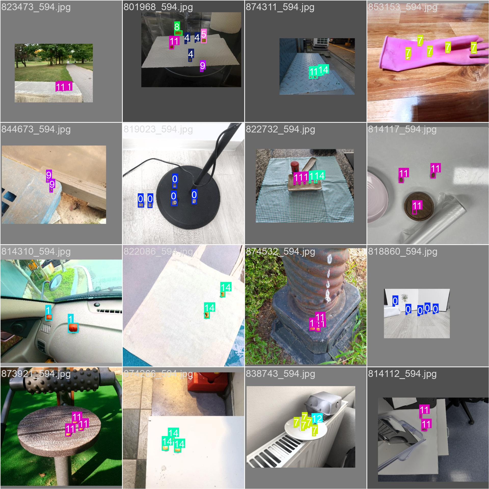
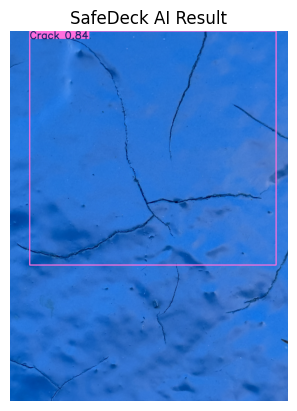
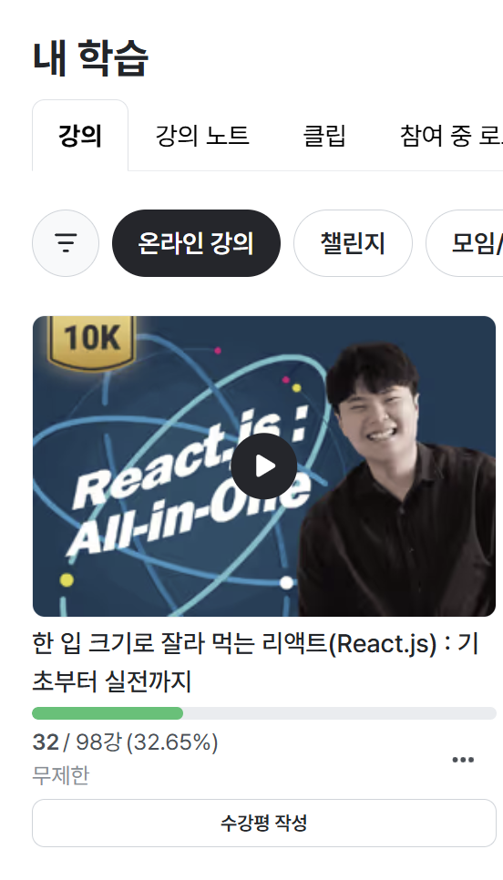
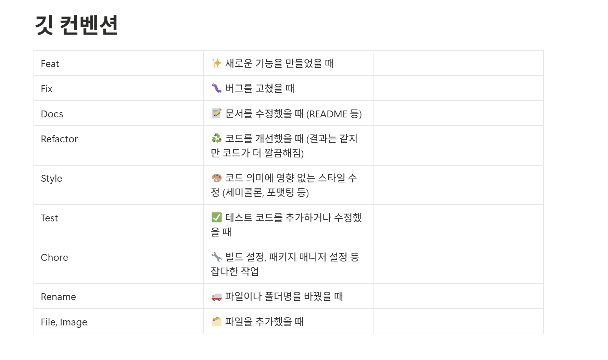

# 📑 1주차 주간 학습 및 프로젝트 진행 기록

## 📑 목차

1. 25.01.11 - 25.01.16 학습 내용
* 1.1 AI & Data Engineering
* 1.2 Front-End & Design
* 1.3 Embedded
* 1.4 Communication & PM

2. 주간 회고 및 향후 목표 (KPT 회고)
* 2.1 Keep (만족스러운 점)
* 2.2 Problem (아쉬운 점)
* 2.3 Try (향후 목표 및 계획)

---

## 1. 25.01.11 - 25.01.16 학습 내용

### 1.1 AI & Data Engineering: 모델 고도화 및 전처리
프로젝트의 주제인 선박 균열 탐지를 위해서는 YOLO 모델을 사용하여야 했습니다. YOLO 모델을 사용한 객체 탐지를 할 수 있도록 AI 모델 학습 실습이 필요하다고 판단했습니다. 따라서 세 차례의 모델 학습 실습을 자체적으로 진행하였습니다.

* **YOLOv8 기반 단계별 학습 수행**
* **기초 학습:** 첫번째 실습으로, AI HUB의 견과류 데이터를 활용하여 YOLOv8의 객체 탐지 메커니즘을 익히고 분류 모델을 생성하는 실습을 진행했습니다.

* **심화 학습:** 두번째 실습에서는 프로젝트 주제인 '선박 도장 품질 검사' 데이터를 확보하여 약 4,000장의 이미지를 학습시키는 실습을 진행했습니다. 이를 통해 선박 결함(녹, 균열, 박리 등)을 자동으로 포착하는 객체 탐지 모델(`best.pt`)을 구축했습니다.
* [📄 Image Segmentation 학습 코드 확인](./results/moving_file.ipynb)

* 해당 모델로 팀원이 직접 수집한 선박 균열 사진 데이터셋을 분류해보았습니다.

* 실습에서 학습한 내용은 기술 블로그에 기록하였습니다.
* [🔗 [YOLO] YOLOv8 모델을 통해 이미지 데이터 학습시키기](https://attention-is-all-i-need.tistory.com/25)

* **YOLO Segmentation 전환 시도**
* 세번째 실습으로는 단순 바운딩 박스(Bounding Box) 탐지를 넘어, 결함의 면적과 형태를 정밀하게 파악하기 위해 **YOLOv8 Segmentation** 모델로의 고도화를 추진 중입니다. 현재 파이썬 코드를 통해 세그멘테이션 학습을 진행하고 있습니다.
* [📄 Image Segmentation 학습 코드 확인](./results/image_segmentation.ipynb)

* **학습 데이터 파이프라인 최적화**
* 이미지 해상도와 관계없이 상대적 위치 학습이 가능한 YOLO 형식의 데이터를 만들기 위해, JSON 메타데이터를 경량화된 TXT 파일로 변환하는 전처리 과정을 수행했습니다.

### 1.2 Front-End & Design

* **Figma 디자인 시스템 및 협업 프로세스 학습**
* 피그마 특강을 통해 **FigJam**을 활용한 브레인스토밍, **Figma Design**을 통한 UI 설계 기법을 익혔습니다. 특히 오토 레이아웃과 반응형 디자인 기능을 통해 개발 효율을 높이는 디자인 협업 방식을 경험했습니다. 특강에서 배운 내용은 추가적으로 기술 블로그에 적으며 회고하였습니다.
* [🔗 Figma 특강 회고 및 장점 정리 (기술 블로그)](https://attention-is-all-i-need.tistory.com/24)

* **React 프레임워크 역량 강화**
* FE 담당자로서 완성도 높은 대시보드 구축을 위해 React 강의를 수강하며 컴포넌트 설계 및 상태 관리 로직을 학습하고 있습니다. 이번 주 금요일까지 목표 강의 수강률은 30%였는데, 현재 32%를 달성하였습니다. 이번 주까지 완강하는 것이 목표입니다.

### 1.3 Embedded: 온디바이스 AI 환경 조성
싸피 일과 이후에도 교보재를 수령하여 약 4시간을 온디바이스 환경 조성 및 사용법 숙지에 사용하였습니다.

* **H/W 초기 환경 세팅**
* 젯슨 오린 나노(Jetson Orin Nano)와 *라즈베리 파이(Raspberry Pi)에 Ubuntu OS를 설치하고 기본 개발 환경 구성을 완료했습니다.
* 향후 학습된 모델을 온디바이스 환경에서 실시간 구동하기 위한 기초 라이브러리 설정을 마무리했습니다.

### 1.4 Communication & PM

* **현직자 인터뷰 추진 및 자료 조사**
* 실무 현장의 페인 포인트를 파악하기 위해 선박 검사원들의 사례를 20건 이상 분석했습니다. 이를 바탕으로 현직자 질문 리스트를 작성하였습니다. 또한 현직 선박 검사원분께 직접 연락을 드려 인터뷰 협조를 얻어냈으며, 현재 상세 질문지를 전달하고 답변을 대기 중입니다.
* [📄 현직자 질문 리스트](./results/interview.md)

* **프로젝트 가이드라인 및 아키텍처 수립**
* **Software Architecture:** 노션에 아키텍처 설계 시 필수 체크리스트를 제작하여 기획의 구체성을 높였습니다.
* **Convention:** 효율적인 협업을 위해 Git 컨벤션을 정리하였습니다.
* 

---

## 2. 주간 회고 및 향후 목표 (KPT)

### 2.1 Keep (만족스러운 점)

* **적극적인 의견 개진:** 비전공자이다 보니 전공자분들에 비해 기술 스택이나 여러모로 부족한 점이 많음을 느꼈습니다. 그래서 제 장점이라고 생각하는 창의성과 아이디어 발산에서 적극적으로 활동하며 부족한 점을 메우고자 노력했습니다. 그 결과 아이디어 회의에서 4가지 이상의 의견을 제안하였으며, 그 중 한 주제가 최종 주제로 선정되었습니다. 
* **지속적인 학습 태도:** 공통 프로젝트 1주차에 적었던 회고 글 중, '모르는 부분을 질문하는 것을 망설이게 된다는 점이 아쉽다'고 적었었습니다. 이번 주에는 모르는 부분을 부끄러워하기보다 질문하면서 배우겠다는 태도를 가지고자 했습니다. 따라서 적극적으로 모르는 부분을 질문하되, 질문한 내용은 기술 블로그에 정리하며 질문을 번복하지 않고 모르는 내용을 확실히 짚고 넘어가도록 노력했습니다.

### 2.2 Problem (아쉬운 점)

* **임베디드 탐구 비중 불균형:** AI 모델 학습에 집중하느라 하드웨어 장비의 세부 기능을 깊이 있게 탐구할 시간이 부족했습니다.
* **기술적 구현 고민의 부재:** 강의 수강에 치중하여 실제 프로젝트 UI/UX 설계 및 백엔드와 소통하는 시간이 상대적으로 부족했습니다.
* **도구 활용의 관성:** 새로운 협업 툴(Jira, Figma)을 배웠음에도 익숙한 기존 툴(Notion)에 의존하려는 경향이 있었습니다.
* **모델 평가 지표 분석 누락:** 학습 과정에만 집중하여 성능을 객관적으로 입증할 수 있는 평가 지표 분석을 진행하지 못했습니다.

### 2.3 Try (향후 목표 및 계획)

* **모델 성능의 정량적 평가:** 다음 주에는 학습된 모델을 객관적으로 검증하기 위해 **정확도(Accuracy), 정밀도(Precision), 재현율(Recall), F1-Score** 등 다양한 성능 지표 분석을 병행하겠습니다. 특히 결함 탐지의 특성을 고려하여 오탐율을 줄이고 최적의 조화평균(F1-Score)을 도출하는 데 집중하고자 합니다.
* **온디바이스 모델 탑재:** 학습된 YOLOv8 모델을 젯슨 오린 나노에 실제로 이식하여 실시간 객체 분류 테스트를 수행하겠습니다.
* **FE-BE 협업 및 실무 설계:** 리액트 강의 완강 후 백엔드 팀원들과 API 연동 논의를 시작하고, Figma를 활용해 구체적인 대시보드 화면을 설계하겠습니다.
* **기술 블로그 자산화:** 새롭게 접하는 기술 용어와 해결 과정을 블로그에 기록하여 지식을 체계화하겠습니다.

---
