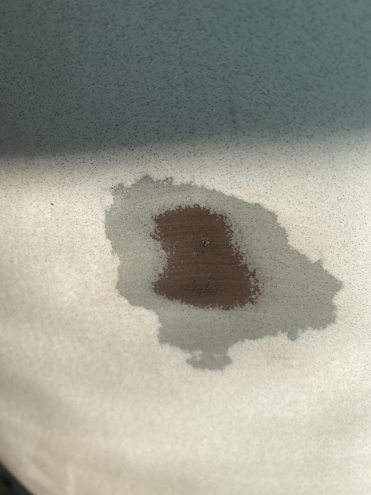
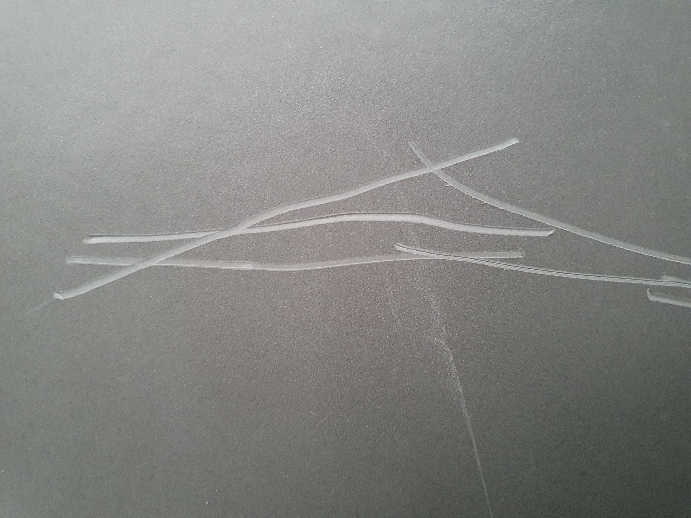
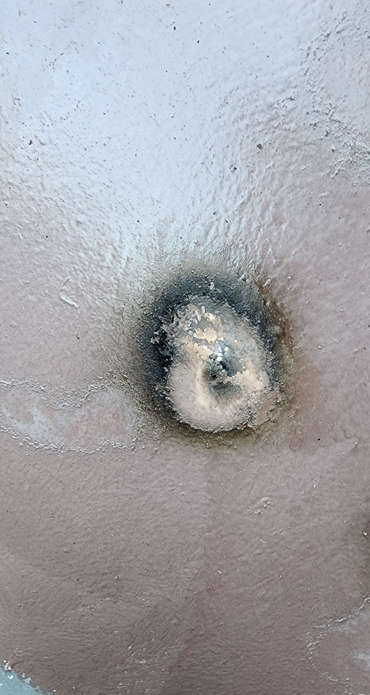
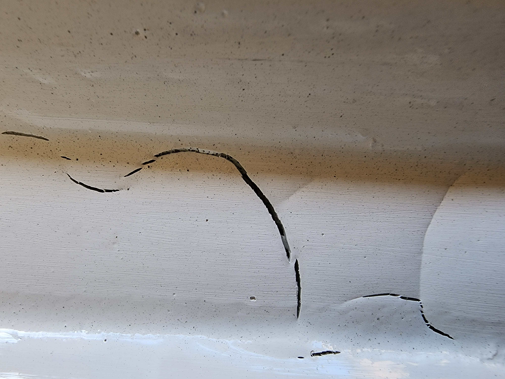
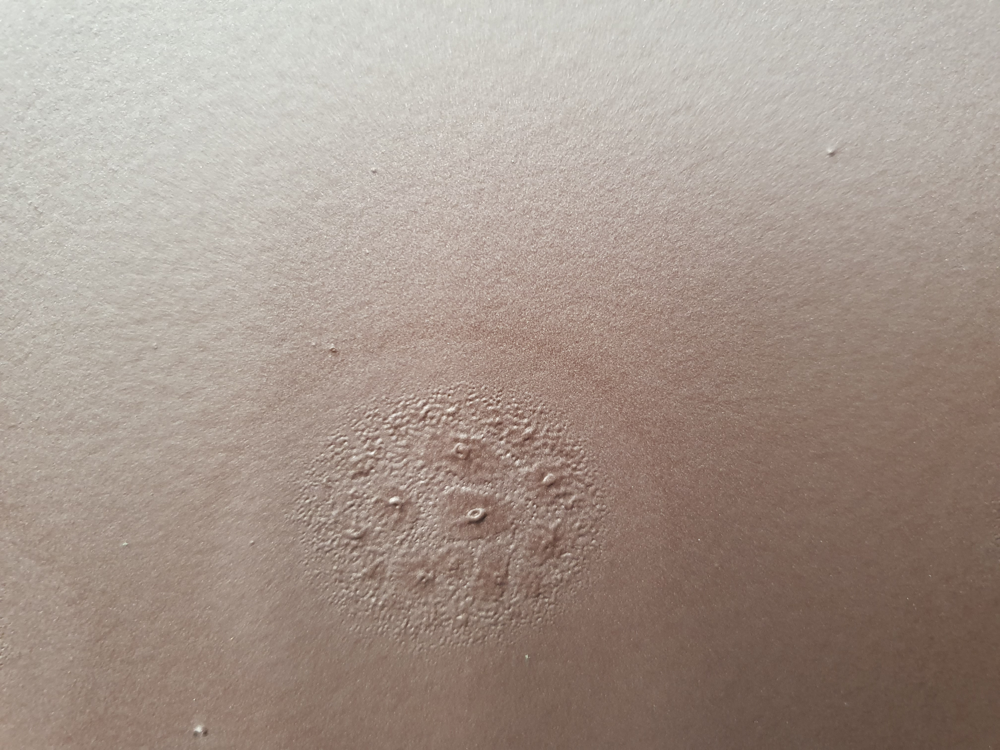
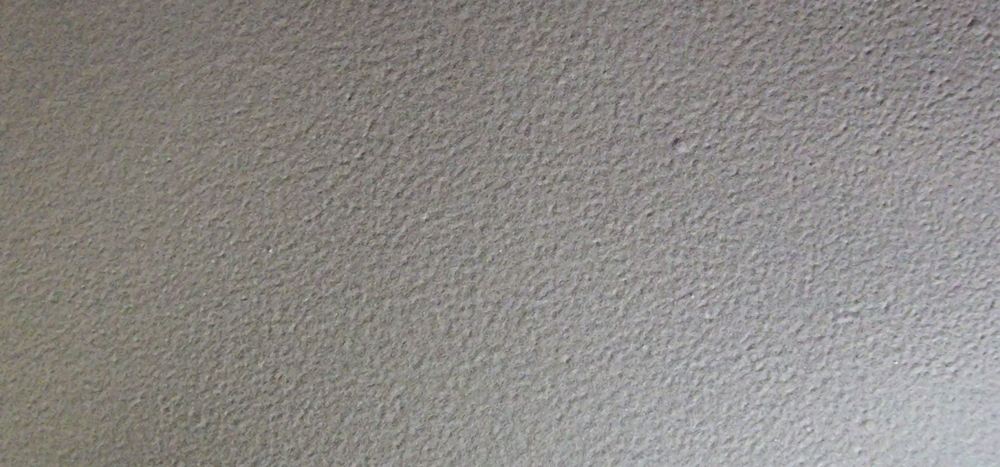
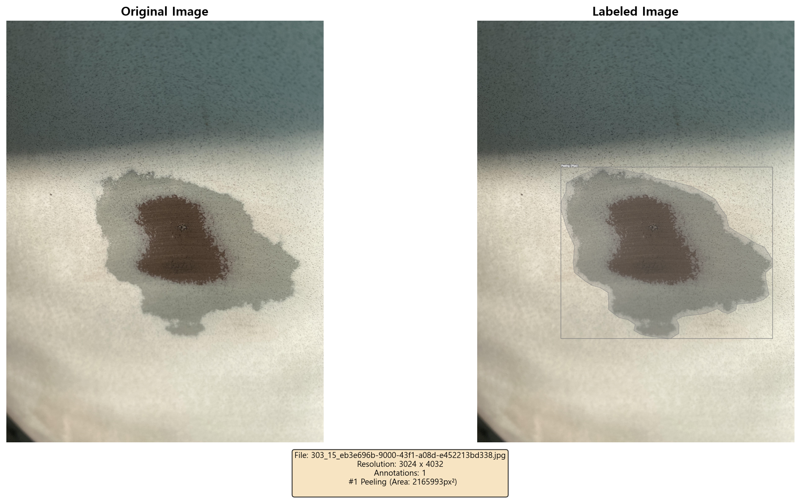
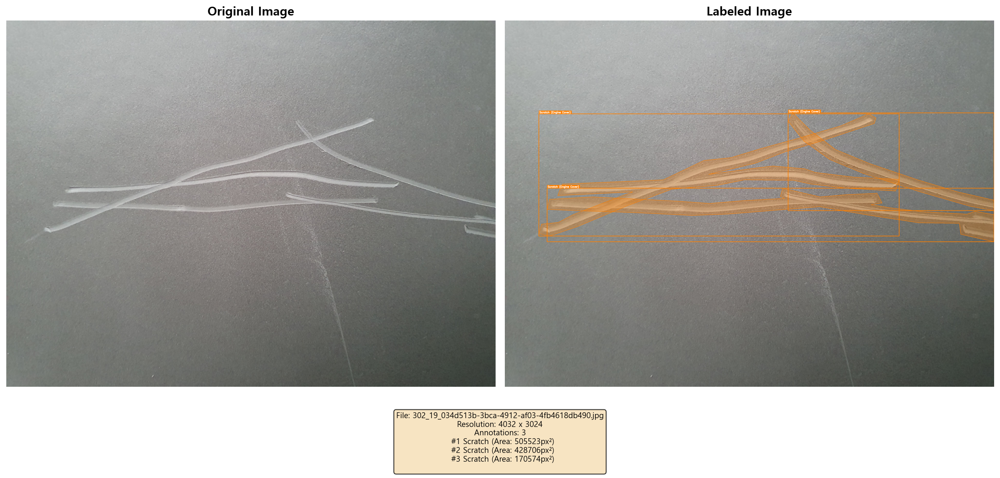
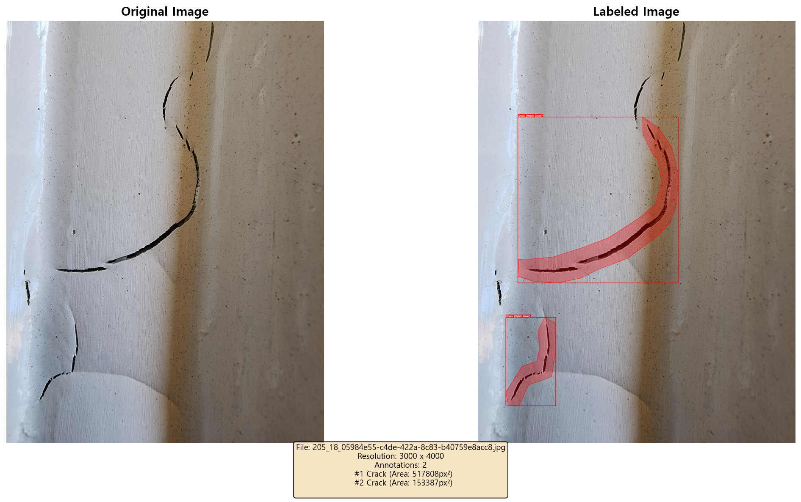

# 선박 도장 품질 측정 AI 프로젝트

선박 도장 상태를 AI로 자동 감지하고 3D로 시각화하는 프로젝트입니다.

---

## 이번 주 진행 내용

### 1. 데이터 분석 및 AI 모델 개발 계획

**AIHUB 선박 도장 품질 데이터셋 분석**

- 총 11개 결함 유형 분류 체계 파악
- COCO 형식 JSON 라벨 데이터 구조 분석
- 이미지 해상도: 4032x3024

**결함 분류 체계**

| 대분류 | 세부 유형 |
|--------|----------|
| 도막 손상 (3종) | 도막 떨어짐, 스크래치, 용접 손상 |
| 도장 불량 (7종) | 부풀음, 균열, 핀홀, 흐름, 워터스포팅, 도막분리, 이물질 |
| 정상 (10부위) | 갑판, 선수, 선미, 외판, 기관실 등 |

**데이터 샘플 예시**

| 도막 손상 (Peeling) | 도막 손상 (Scratch) | 도막 손상 (Welding) |
|:---:|:---:|:---:|
|  |  |  |

| 도장 불량 (Crack) | 도장 불량 (Blister) | 정상 (Normal) |
|:---:|:---:|:---:|
|  |  |  |

**라벨링 데이터 시각화 분석**

COCO 형식의 JSON 라벨 데이터를 파싱하여 원본 이미지에 바운딩 박스와 세그멘테이션 마스크를 오버레이하는 시각화 작업을 수행했습니다.

- Bounding Box: 결함 영역을 사각형으로 표시
- Segmentation Mask: 결함 영역을 폴리곤으로 정밀하게 표시
- 메타데이터: 파일명, 해상도, 어노테이션 수, 영역 크기 등 표시

**시각화 결과 예시**


*도막 떨어짐(Peeling) - 원본 vs 라벨링 오버레이*


*스크래치(Scratch) - 원본 vs 라벨링 오버레이*


*균열(Crack) - 원본 vs 라벨링 오버레이*

**AI 모델 개발 계획**
- Object Detection / Instance Segmentation 모델 적용 예정
- YOLOv8 또는 Mask R-CNN 검토 중
- 결함 위치를 3D 모델에 매핑하는 파이프라인 설계

### 2. 3D 뷰어 프로토타입 테스트

React + Three.js 기반 3D 선박 뷰어를 구현하여 테스트했습니다.

**구현 기능**
- GLB/GLTF 3D 모델 로딩
- 마우스 드래그로 회전, 스크롤로 줌
- 자동 회전, 조명 제어
- 설정 저장 (LocalStorage)

**3D 뷰어 화면**

<!-- 3D 뷰어 스크린샷 또는 GIF를 여기에 추가하세요 -->
<!--  -->


**실행 방법**
```bash
cd ship-viewer
npm install
npm start
```

---

## AIoT 학습 내용 리뷰

이번 주 SSAFY AIoT 교육에서 학습한 내용을 정리했습니다.

### Sub1: IoT 센서 제어 (Raspberry Pi)

| 센서/액추에이터 | 학습 내용 |
|----------------|----------|
| DHT22 | 온습도 센서 데이터 읽기 |
| 초음파 센서 | HC-SR04로 거리 측정 |
| 터치 센서 | GPIO 입력 처리 |
| LED/서보 | PWM 제어로 출력 조절 |
| Flask | 웹 기반 센서 모니터링 대시보드 |

### Sub2: AI 비전 처리 (Jetson Orin)

| 기술 | 학습 내용 |
|------|----------|
| YOLOv8 | 실시간 객체 탐지, 커스텀 모델 학습 |
| ResNet-18 | 이미지 분류 (Transfer Learning) |
| CNN | 커스텀 CNN 모델 구현 |
| OpenCV CUDA | GPU 가속 이미지 처리 |
| Orin Car | Person Following 자율 주행 |

### Sub3: 통신 및 웹 인터페이스

| 기술 | 학습 내용 |
|------|----------|
| TCP Socket | Raspberry Pi ↔ Jetson Orin 통신 |
| Flask 웹서버 | MJPEG 비디오 스트리밍 |
| MediaPipe | 손 제스처 인식, 포즈 추정 |
| YDLidar | 360도 라이다 센서로 SLAM |

---

## 프로젝트 구조

```
common-AI/
├── Dataset/                    # 선박 도장 이미지 데이터셋
│   ├── 01.images/              # 원본 이미지
│   │   ├── coating_damage/     # 도막 손상
│   │   ├── painting_defect/    # 도장 불량
│   │   └── normal/             # 정상
│   └── 02.labels/              # COCO 형식 라벨
│
├── ship-viewer/                # React 3D 뷰어
│   ├── src/components/         # React 컴포넌트
│   └── public/models/          # 3D 모델 파일
│
├── aiot-skeleton/              # AIoT 학습 실습 코드
│   ├── Sub1/                   # IoT 센서 제어
│   ├── Sub2/                   # AI 비전 처리
│   └── Sub3/                   # 통신 및 웹
│
├── visualize_data.py           # 데이터 시각화 스크립트
├── visualize_and_save_all.py   # 어노테이션 오버레이 저장
├── rename_to_english.py        # 폴더명 영문 변환
└── data_visualization.ipynb    # 데이터 분석 노트북
```

---

## 기술 스택

| 분야 | 기술 |
|------|------|
| 데이터 처리 | Python, OpenCV, NumPy, Matplotlib |
| 3D 시각화 | React, Three.js, @react-three/fiber |
| AI/ML | PyTorch, YOLOv8, ResNet, MediaPipe |
| IoT | Raspberry Pi, Jetson Orin, GPIO |
| 웹 | Flask, TCP Socket, MJPEG |

---

## 향후 계획

1. AI 모델 학습 (YOLOv8 기반 결함 탐지)
2. 3D 뷰어와 AI 결과 통합
3. 결함 위치를 3D 선박 모델에 시각화
